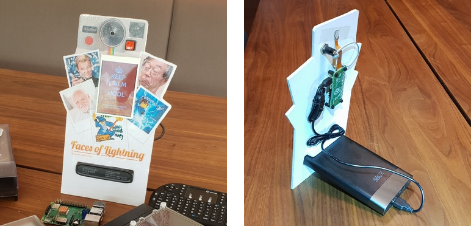

# Flashbox
Flashbox: Tweet your digital polaroid souvenir, pay with Lightning

> Barebone initial description more comprehensive information incl. hardware setup is in the making. 

In my setup, all pictures are tweeted on the **Faces of Lightning** ([@faceslightning](https://twitter.com/FacesLightning)) Twitter profile. 

## Motivation
Use case: Put up a photobox at events or public locations to allow your audience to take a digital polaroid souvenir, pay a small fee, tweet it automatically and make your event hashtag trending. 

Technical: build an autonomous Lighnting Node on very minimal hardware, namely a Raspberry Pi Zero, that has only one core and 512 MB memory
* Step 1: the Flashbox uses an external server to create Lightning invoices & check payments (working)
* Step 2: the Flashbox is a completely self-reliant Lightning node without external support (in progress, probably not relevant IRL, but a nice challenge)

## Components
You can easily build this yourself with:
* Raspberry Pi Zero W (with wifi) -> $18
* Display Shield 3.5 TFT touch screen for GPIO -> $16
* Raspberry Pi Zero Camera -> $20
* Micro SD card (4GB+) -> $5
* physical touch button & a few wires

The Python program uses these main libraries:
* [gpiozero](https://www.raspberrypi.org/blog/gpio-zero-a-friendly-python-api-for-physical-computing/): use the GPIO pins to attach physical stuff like buttons
* [picamery](https://picamera.readthedocs.io/en/release-1.13/): take picture with the Pi Camery
* [wand](http://docs.wand-py.org/en/0.4.4/): process images with ImageMagick  
* [tweepy](http://www.tweepy.org/): tweet the picture

There are additional programs necessary on operating system level:
* ImageMagick (package `libmagickwand-dev`)
* [FFmpeg](https://ffmpeg.org/)
* other stuff, will be added soon

## Working example

## Source code
The lighting integration is amazingly simple, both for API and on-device lightning. Most of the code is picture processing.
* Flashbox (API): [flashbox-api.py](https://github.com/Stadicus/flashbox/blob/master/flashbox-api.py)
* Flashbox (on-device): coming soon
